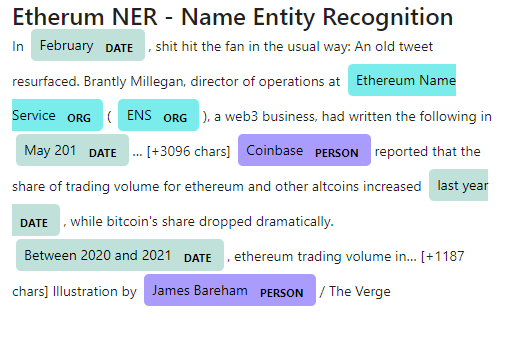

# Unit - 12 Tales from the Crypto

## Assignment by Dorothy Doutre 


## Assigment Summary:

For this assignment we are tasked with applying natural language techniques (NLP) to understand the sentiment of the latest news relating to Ethereum and Bitcoin. The NLP techniques were also used to understand other factors involved with coin prices such as common words, phrases, organisations and entities.

The following techniques utilised to complete this assignment:

### Sentiment Analysis:

```
NewsApiClient - reading in and fetching news articles.
Creating a sentiment function.
Describing both Bitcoin and Ethereum sentiments.
```

### Natural Language Processing:

```
Python to tokenize, which included:

Lowercase each word.
Remove punctuation.
Remove stop words.

N-grams and word frequency for each coin.

Use NLTK to produce the ngrams and list the top 10 words for each coin.

Word Clouds
```

### Name Entity Recognition:

```
Name Entity Recognition model for both Bitcoin and Ethereum.

Visualised the tags using SpaCy.
```

### Technologies used:
- GitBash
- Python
- Jupyter-lab (mlenv environment)
- VS Code

---

## Assignment findings

### Sentiment Analysis:

**Which coin had the highest mean positive score?**

Etherum had the highest mean at 0.078

**Which coin had the highest negative score?**

Ethereum at 0.31

**Which coin had the highest positive score?**

Bitcoin at 0.30

### Natural Language Processing:

Top 10 words (list) for Bitcoin and Ethereum respectively.


WordCloud - Bitcoin


WordCloud - Ethereum


### Named Entity Recognition (NER): 

NER - Bitcoin (sample output)


NER - Ethereum (sample output)



